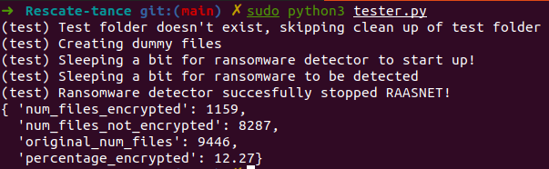

# Rescate Tance

[](https://codeclimate.com/github/omar2535/Rescate-tance/maintainability)
[](https://github.com/omar2535/Rescate-tance/actions/workflows/lint.yaml)


A POC ransomware detector for CMPT733 project

## 🔮 Requirements

- Python3.5+

and some other requirements here:

```sh
sudo apt install iotop python3-pip python3-tk python3-pil python3-pil.imagetk libgeoip1 libgeoip-dev geoip-bin
```

## ⚒ Setup

**Setting up the environment:**

```sh
# Creating the virtual environment
python3 -m venv .env

# Activating the virtual environment
source .env/bin/activate
```

**Installing dependencies:**

```sh
(.env) pip install -r requirements.txt
```

**Setting up pre-commit hooks:**

```sh
(.env) pre-commit install
```

## 🔧 Usage

Using the program to run detectors can be done like so:

```sh
python3 main.py -d <DetectorName>
```

and for a full menu of command line options, run:

```sh
python3 main.py -h
```

## 📁 Folder structure

- **io-detector**: Detects ranosmware by looking at high file I/O
- **sensory-detector:** Detects ransomware by creating sensor files
- **detectors:** Where all the detector classes are kept as a single point of control
- **tests:** Test scripts. Can be invoked via the `tester.py` in the root directory

## 🕵️‍♀️ Adding a new detector

1. First, make a new folder if there are utilities for this detector in the root directory.
2. Afterwards, create a `<NameHere>Detector.py` file in `detectors/` and define the `run(self, ...)` function!
3. Lastly, add the detector class name in `detectors/__init__.py` to allow the detector to be called from the main program!

## 🧪 Tests

### Signature Detector test

To run tests, make sure the path is in the correct location first for `config.yml`, then run:

```sh
sudo python tester.py
```

This command will run the test in `tests/raasnet_test.py`. The test includes:

- Setting up dummy files recursively for testing
- Setting up the signature detector
- Running the signature detector
- Running the ransomware
- Stopping the ransomware
- Providing benchmarks

A sample run is shown below:



## ⚠ WARNING

**DO NOT RUN THE PAYLOADS IN `tests/ransomware/` DIRECTLY ON YOUR LOCAL MACHINE!!**. You will brick your computer and cause all your files to be encrypted! (We have provided a `keys.txt` file that will be output once the payload is run, but this is still too dangerous!!)
